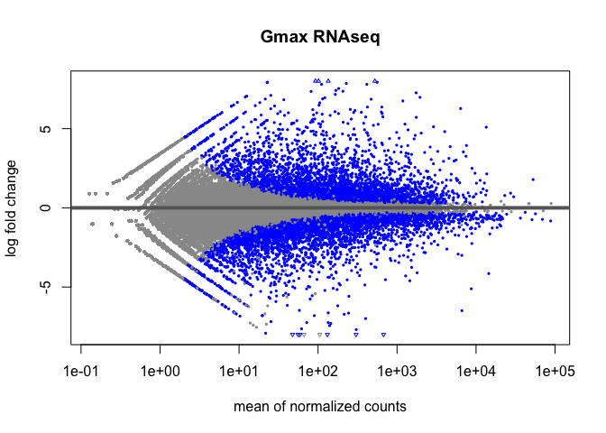
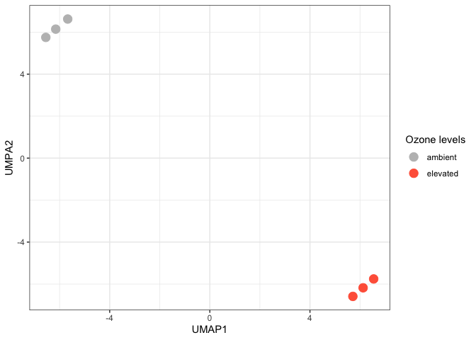
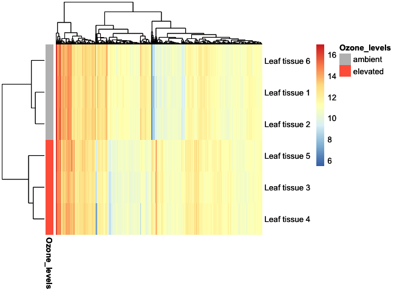

Analysis and Figures
================
2023-10-24

``` r
library(DESeq2)
```

    ## Loading required package: S4Vectors

    ## Loading required package: stats4

    ## Loading required package: BiocGenerics

    ## 
    ## Attaching package: 'BiocGenerics'

    ## The following objects are masked from 'package:stats':
    ## 
    ##     IQR, mad, sd, var, xtabs

    ## The following objects are masked from 'package:base':
    ## 
    ##     anyDuplicated, aperm, append, as.data.frame, basename, cbind,
    ##     colnames, dirname, do.call, duplicated, eval, evalq, Filter, Find,
    ##     get, grep, grepl, intersect, is.unsorted, lapply, Map, mapply,
    ##     match, mget, order, paste, pmax, pmax.int, pmin, pmin.int,
    ##     Position, rank, rbind, Reduce, rownames, sapply, setdiff, sort,
    ##     table, tapply, union, unique, unsplit, which.max, which.min

    ## 
    ## Attaching package: 'S4Vectors'

    ## The following object is masked from 'package:utils':
    ## 
    ##     findMatches

    ## The following objects are masked from 'package:base':
    ## 
    ##     expand.grid, I, unname

    ## Loading required package: IRanges

    ## Loading required package: GenomicRanges

    ## Loading required package: GenomeInfoDb

    ## Loading required package: SummarizedExperiment

    ## Loading required package: MatrixGenerics

    ## Loading required package: matrixStats

    ## 
    ## Attaching package: 'MatrixGenerics'

    ## The following objects are masked from 'package:matrixStats':
    ## 
    ##     colAlls, colAnyNAs, colAnys, colAvgsPerRowSet, colCollapse,
    ##     colCounts, colCummaxs, colCummins, colCumprods, colCumsums,
    ##     colDiffs, colIQRDiffs, colIQRs, colLogSumExps, colMadDiffs,
    ##     colMads, colMaxs, colMeans2, colMedians, colMins, colOrderStats,
    ##     colProds, colQuantiles, colRanges, colRanks, colSdDiffs, colSds,
    ##     colSums2, colTabulates, colVarDiffs, colVars, colWeightedMads,
    ##     colWeightedMeans, colWeightedMedians, colWeightedSds,
    ##     colWeightedVars, rowAlls, rowAnyNAs, rowAnys, rowAvgsPerColSet,
    ##     rowCollapse, rowCounts, rowCummaxs, rowCummins, rowCumprods,
    ##     rowCumsums, rowDiffs, rowIQRDiffs, rowIQRs, rowLogSumExps,
    ##     rowMadDiffs, rowMads, rowMaxs, rowMeans2, rowMedians, rowMins,
    ##     rowOrderStats, rowProds, rowQuantiles, rowRanges, rowRanks,
    ##     rowSdDiffs, rowSds, rowSums2, rowTabulates, rowVarDiffs, rowVars,
    ##     rowWeightedMads, rowWeightedMeans, rowWeightedMedians,
    ##     rowWeightedSds, rowWeightedVars

    ## Loading required package: Biobase

    ## Welcome to Bioconductor
    ## 
    ##     Vignettes contain introductory material; view with
    ##     'browseVignettes()'. To cite Bioconductor, see
    ##     'citation("Biobase")', and for packages 'citation("pkgname")'.

    ## 
    ## Attaching package: 'Biobase'

    ## The following object is masked from 'package:MatrixGenerics':
    ## 
    ##     rowMedians

    ## The following objects are masked from 'package:matrixStats':
    ## 
    ##     anyMissing, rowMedians

``` r
library(tidyverse)
```

    ## ── Attaching core tidyverse packages ──────────────────────── tidyverse 2.0.0 ──
    ## ✔ dplyr     1.1.3     ✔ readr     2.1.4
    ## ✔ forcats   1.0.0     ✔ stringr   1.5.0
    ## ✔ ggplot2   3.4.4     ✔ tibble    3.2.1
    ## ✔ lubridate 1.9.3     ✔ tidyr     1.3.0
    ## ✔ purrr     1.0.2

    ## ── Conflicts ────────────────────────────────────────── tidyverse_conflicts() ──
    ## ✖ lubridate::%within%() masks IRanges::%within%()
    ## ✖ dplyr::collapse()     masks IRanges::collapse()
    ## ✖ dplyr::combine()      masks Biobase::combine(), BiocGenerics::combine()
    ## ✖ dplyr::count()        masks matrixStats::count()
    ## ✖ dplyr::desc()         masks IRanges::desc()
    ## ✖ tidyr::expand()       masks S4Vectors::expand()
    ## ✖ dplyr::filter()       masks stats::filter()
    ## ✖ dplyr::first()        masks S4Vectors::first()
    ## ✖ dplyr::lag()          masks stats::lag()
    ## ✖ ggplot2::Position()   masks BiocGenerics::Position(), base::Position()
    ## ✖ purrr::reduce()       masks GenomicRanges::reduce(), IRanges::reduce()
    ## ✖ dplyr::rename()       masks S4Vectors::rename()
    ## ✖ lubridate::second()   masks S4Vectors::second()
    ## ✖ lubridate::second<-() masks S4Vectors::second<-()
    ## ✖ dplyr::slice()        masks IRanges::slice()
    ## ℹ Use the conflicted package (<http://conflicted.r-lib.org/>) to force all conflicts to become errors

``` r
library(umap)
library(pheatmap)
```

``` r
sampleFiles<- c("SRR391535-output_basename.counts",
                "SRR391536-output_basename.counts",
                "SRR391537-output_basename.counts",
                "SRR391538-output_basename.counts",
                "SRR391539-output_basename.counts",
                "SRR391541-output_basename.counts")
sampleNames <- c("Leaf tissue 1","Leaf tissue 2","Leaf tissue 3","Leaf tissue 4","Leaf tissue 5","Leaf tissue 6")
sampleCondition <- c("ambient","ambient","elevated","elevated","elevated","ambient")
sampleTable <- data.frame(sampleName = sampleNames, fileName = sampleFiles, condition = sampleCondition)

treatments = c("ambient","elevated")

ddsHTSeq <- DESeqDataSetFromHTSeqCount(sampleTable = sampleTable,
                                       directory = "~/rnaseq_example/data/",
                                       design = ~ condition)
```

    ## Warning in DESeqDataSet(se, design = design, ignoreRank): some variables in
    ## design formula are characters, converting to factors

``` r
colData(ddsHTSeq)$condition <- factor(colData(ddsHTSeq)$condition,
                                      levels = treatments)
```

``` r
dds <- DESeq(ddsHTSeq)
```

    ## estimating size factors

    ## estimating dispersions

    ## gene-wise dispersion estimates

    ## mean-dispersion relationship

    ## final dispersion estimates

    ## fitting model and testing

``` r
res <- subset(results(dds), padj<0.05)
resdata <- merge(as.data.frame(res), as.data.frame(counts(dds,normalized =TRUE)), by = 'row.names', sort = FALSE)
head(resdata)
```

    ##   Row.names    baseMean log2FoldChange     lfcSE      stat       pvalue
    ## 1  30473667   24.124686     -3.1171698 0.7485823 -4.164098 3.125860e-05
    ## 2  30473668   10.422402     -3.4140472 0.8654247 -3.944938 7.982048e-05
    ## 3  30473693  102.281432     -1.9919610 0.2773149 -7.183029 6.818360e-13
    ## 4  30473751  489.656517      0.3985668 0.1405221  2.836328 4.563552e-03
    ## 5  30473774    5.506309     -2.5262416 0.9833660 -2.568974 1.020002e-02
    ## 6  30473785 2043.137067     -0.6260674 0.1405519 -4.454350 8.414791e-06
    ##           padj Leaf tissue 1 Leaf tissue 2 Leaf tissue 3 Leaf tissue 4
    ## 1 2.798095e-04     21.900706      25.23628      6.480449     0.9169796
    ## 2 6.388180e-04     26.112380      14.84487      0.000000     1.8339591
    ## 3 2.199935e-11    171.836310     172.20048     54.435771    30.2603253
    ## 4 2.092997e-02    425.379101     394.87352    567.687328   555.6896098
    ## 5 4.088138e-02      9.265683      10.39141      2.592180     0.9169796
    ## 6 8.665825e-05   2671.886153    2538.47261   1583.821724  1745.9290709
    ##   Leaf tissue 5 Leaf tissue 6
    ## 1      7.668517     82.545184
    ## 2      3.067407     16.675795
    ## 3     39.876289    145.079415
    ## 4    549.065824    445.243721
    ## 5      1.533703      8.337897
    ## 6   1489.992871   2228.719973

``` r
plotMA(dds, ylim=c(-8,8), main = "Gmax RNAseq")
```

<!-- -->

``` r
dds_norm <- vst(dds)
normalized_counts <- t(assay(dds_norm))

umap_results <- umap::umap(normalized_counts, n_neighbors = 3)
```

    ## Warning: failed creating initial embedding; using random embedding instead

    ## Warning: failed creating initial embedding; using random embedding instead

``` r
ggplot(data.frame(umap_results$layout) %>% cbind(dds$condition), aes(x = X1, y = X2, color = dds$condition)) +
  geom_point(size = 4) + 
  labs(y = "UMPA2", x = "UMAP1", color = "Ozone levels") +
  scale_color_manual(values = c("gray", "tomato1")) +
  theme_bw()
```

<!-- -->

``` r
selection <- order(rowMeans(counts(dds,normalized=T)),decreasing=T)[1:1000]

df_annotation <- data.frame(row.names = c("Leaf tissue 1", "Leaf tissue 2", "Leaf tissue 3", "Leaf tissue 4", "Leaf tissue 5", "Leaf tissue 6"),
                            Ozone_levels = c("ambient","ambient","elevated","elevated","elevated","ambient"))
annotation_colors = list(Ozone_levels = c(ambient = "gray", elevated = "tomato1"))
p <- pheatmap(t(assay(dds_norm)[selection,]),
              annotation_row = df_annotation,
              annotation_colors = annotation_colors,
              show_colnames = F)
p
```

<!-- -->
